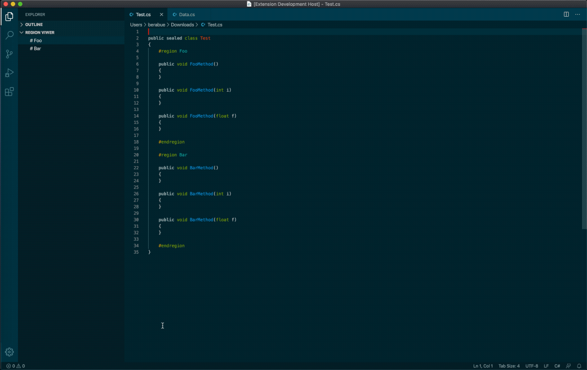

# Region Viewer Extension

__Region Viewer__ allows you to print a list of regions in a document and select a region to navigate to the document's location.



## Language support

Region Viewer supports all languages which have [folding markers](https://code.visualstudio.com/docs/editor/codebasics#_folding) defined for them. The `[name]` placeholder stands for an optional custom region name.

| Language | Region start | Region end |
| --- | --- | --- |
AL|`[//]#region [name]`|`[//]#endregion`
Bat|`::#region [name]` or `REM #region [name]`|`::#endregion` or `REM #endregion`
C#|`#region [name]`|`#endregion`
C/C++|`#pragma region [name]`|`#pragma endregion`
CSS / Less / SCSS|`/*#region [name]*/`|`/*#endregion*/`
Coffeescript|`#region [name]`|`#endregion`
F#|`//#region [name]` or `(#region [name])`|`//#endregion` or `(#endregion)`
Go|`//#region [name]` |`//#endregion`
HTML / XML|`<!-- #region [name] -->`|`<!-- #endregion -->`
Java|`//#region [name]`|`//#endregion`
Markdown|`<!-- #region [name] -->`|`<!-- #endregion -->`
Perl5|`#region [name]`|`#endregion`
PHP|`#region [name]`|`#endregion`
PowerShell|`#region [name]`|`#endregion`
Python |`#region [name]` or `# region [name]`|`#endregion` or `# endregion`
Shellscript |`#region [name]` or `# region [name]`|`#endregion` or `# endregion`
TypeScript / JavaScript|`//#region [name]` |`//#endregion`
Visual Basic|`#Region [name]`|`#End Region`
Yaml|`#region [name]` or `# region [name]`|`#endregion` or `# endregion`
JSONC|`/*#region [name]*/`|`/*#endregion*/`

The exact regular expressions can be found in this extension's [markers.json](./src/markers.json).

## Add Language Overrides
To add a language override you will need the language id and a regex for both the start and end substring that will reflect the region.
While the extension view is open there will be an info icon that can be clicked. This will show a info dialog displaying the language id of the currently active document.
Once the language id and the regex is ready, it is as simple as adding the following format to the settings.json file:

```json
{
    /// Other settings
    "region-viewer.markers-overrides": {
        "[language-id]": {
            "start": "^\\s*//\\s*#?region\\b(?<name>.*)", // <name> will be used to to give the region a name
            "end": "^\\s*//\\s*#?endregion\\b"
        },
    }
}
```